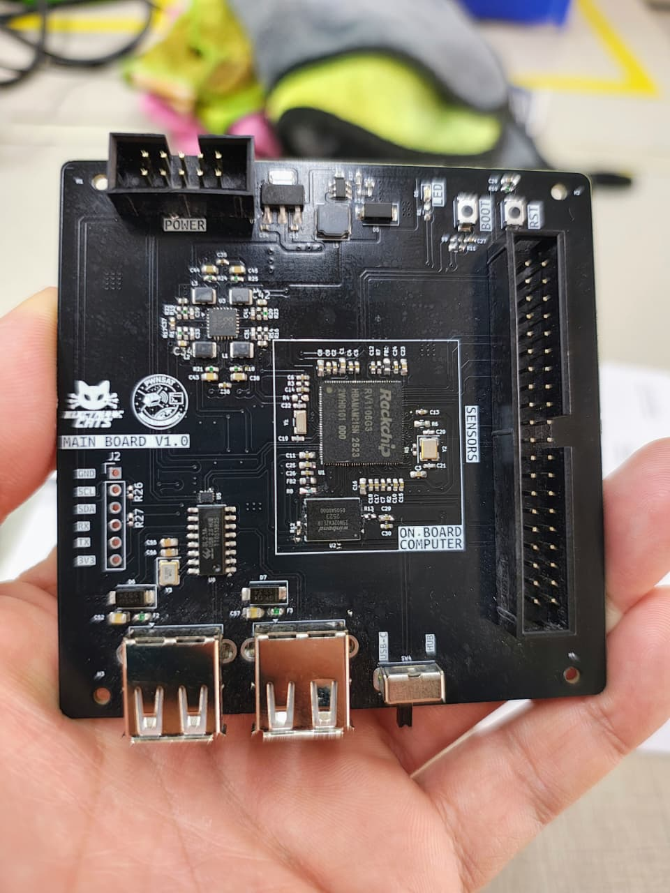
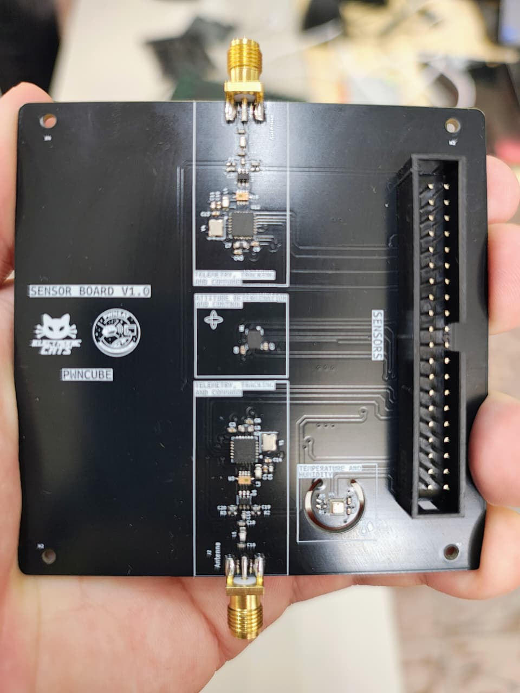

# PwnSat 2.0: The Vulnerable Satellite Hacking Platform for Learning Through Research

PwnSat is the first open-source, vulnerable-by-design aerospace cybersecurity platform. It bridges the gap between traditional IT security and specialized Space Mission Operations (SMO). Developed over six years of research, PwnSat 2.0 scales from a basic FlatSat to a high-fidelity enterprise environment, designed specifically for advanced offensive and defensive research.

## Project Overview

PwnSat replicates a complete end-to-end space mission ecosystem, allowing researchers to explore vulnerabilities across the entire attack surface:
* **Space Segment:** 1U CubeSat Hardware (OBC, EPS, and Radio).
* **Ground Segment:** Multi-band RF Gateway (LoRa/FSK).
* **C3 Segment:** Native integration with Ball Aerospace COSMOS for enterprise-grade command and control.

## New for v2.0 (Black Hat USA Release)

The 2.0 "Enterprise Edition" introduces critical updates over the initial release:
* **GNSS Attack Module:** Integration of a physical GNSS sensor to simulate signal jamming and positioning spoofing, affecting the satellite's AOCS (Attitude and Orbit Control System).
* **COSMOS C3 Integration:** Support for industry-standard mission control software, replacing custom dashboards with tools used by NASA and commercial space ventures.
* **Ground Station Pivot:** New scenarios demonstrating lateral movement from a compromised MOC backend to the satellite RF uplink.

## Hardware Architecture

The platform is built on custom-designed PCBs (v1.1) optimized for RF integrity and modularity.

### Flight System Components

| Component | Specification |
| :--- | :--- |
| **OBC (Flight Computer)** | ESP32-S3 (Dual-core, hardware encryption support) |
| **Radio Subsystem** | Semtech SX1276/78 (Multi-band LoRa/FSK) |
| **GNSS Module** | Integrated positioning sensor for navigation research |
| **Sensors** | IMU, Thermal, and Simulated Power System (EPS) |

### Hardware Gallery

The following boards represent the core of the PwnSat 1U system:

**1. Main Flight Computer (OBC) & Navigation Board**
This board handles the flight logic, telemetry processing, and the newly integrated GNSS sensor.

**2. RF Communications & Shielding Subsystem**
Dedicated module for handling CCSDS and AX.25 protocol stacks over the physical radio link.

**3. Power Distribution & Modular Bus**
The EPS (Electronic Power System) simulation board, featuring intentional vulnerabilities in power rail management.

## Technical Research Scenarios (SPARTA Mapping)

Each vulnerability in PwnSat is mapped to the **SPARTA (Space Attack Research & Tactics Analysis)** framework to ensure professional-grade research relevance:

### 1. Electronic ASAT (Navigation Spoofing)
Using the new GNSS module, researchers can demonstrate how spoofing signal data tricks the OBC into incorrect positioning calculations, leading to unauthorized attitude maneuvers.

### 2. Space Link Exploitation
* **Uplink Hijacking:** Injecting unauthorized CCSDS frames into the command stream.
* **Telemetry Forgery:** Manipulating AX.25 packets to mask malicious activity on the satellite.

### 3. Ground Segment Lateral Movement
Demonstration of a "Full-Chain" compromise:
* Exploiting a web-based vulnerability in the MOC.
* Pivoting to the COSMOS C3 instance.
* Executing an unauthorized "Kill-Command" through the RF Ground Station.

## Repository Structure

* `/hardware`: KiCad schematics, Gerber files, and Bill of Materials (BOM).
* `/firmware`: ESP32-S3 flight code and radio drivers (PlatformIO).
* `/ground-station`: Dockerized MOC and Ball Aerospace COSMOS configuration files.
* `/docs`: Technical architecture whitepapers and SPARTA mapping guides.

## Disclaimer

PwnSat is intended for educational and ethical research purposes only. Always conduct RF testing within a shielded environment (Faraday cage) to comply with local radio frequency regulations.

## Credits & License

**Developed by:** PWNSAT Team & Electronic Cats
**Research Duration:** 2019 - 2026
**License:** GNU General Public License v3.0
